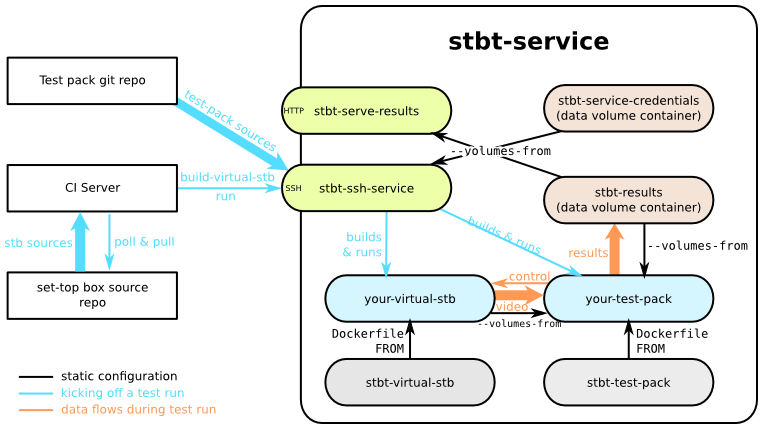

stb-tester service README
=========================

The stb-tester service is intended to:

* Simplify management of stb-tester test farms

* Provide greater guarantees about reproducibility of test runs

* Allow more power when creating a test-pack

* Make it easier to integrate stb-tester into external systems such as Jenkins
  CI

* and make it easier to use stb-tester remotely

We do this using docker containers to manage any system state explicitly to
provide traceability and reproducibility without constraining user flexibility:

* User test scripts are run in their own container, which users can customise
  themselves to the extent that they can install any packages they need to use
  in their test scripts, or choose a different or customised version of
  stb-tester.  We call these containers/images/git repos "test packs"

* The user test pack is reset between test runs so you know exactly what state
  it's in.  No more worries that the test machine was left in some funny state
  or that your dependencies are missing, broken or at the wrong version.

* The command to run in the test pack is unconstrained, much like sshing into
  a machine.

* The git checkout of the test pack, and even the creation of the test pack
  image are cached, so running a command remotely is *fast* and can be treated
  like stbt were running locally.  stb-tester doesn't run on your Windows
  desktop PC?  No problem, you can be just as productive remotely.

* We apply the same approach to the stbt service infrastructure itself.  It is
  entirely *dockerized* allowing easy installation and upgrades.  By separating
  the code from the state we can upgrade/rollback the code with confidence.

Setup Instructions
------------------

1. Create the auth container which will contain our ssh and git credentials.

        docker run --name="stbt-service-credentials" \
            stbtester/stb-tester-service-credentials

2. Add login credentials to the auth volume:

        docker run -i --rm --volumes-from=stbt-service-credentials ubuntu:14.04 \
            tee /etc/stbt/users/$(whoami).pub <$HOME/.ssh/id_rsa.pub

3. Create the results container which will contain the test results

        docker run --name="stbt-service-results" \
            stbtester/stb-tester-service-results

4. Run the results container on port 80 (it's also a good idea to configure
   your system to run this at startup):

        docker run --rm -p 80:8000 -v /etc/localtime:/etc/localtime:ro \
            --volumes-from=stbt-service-results \
            --name=stbt-serve-results \
            stbtester/stb-tester-serve-results

5. Run the service container to accept SSH connections on port 22 (it's also a
   good idea to configure your system to run this at startup)

        docker run --rm -p 22:22 -v /etc/localtime:/etc/localtime:ro \
            -v /var/run/docker.sock:/var/run/docker.sock \
            --volumes-from=stbt-service-credentials \
            --volumes-from=stbt-service-results \
            --name=stbt-service \
            stbtester/stb-tester-service

Overview
--------

Conceptually running `ssh stbt-ssh-endpoint run [command]` is intended to be
like sshing into a freshly started machine which has your test pack sources
available and stb-tester configured to consume video/control an attached set-top
box.  So the command:

    ssh test-machine-hostname stbt-ssh-endpoint run \
        --test-pack=ssh://git@github.com/my-company/my-test-pack \
        stbt batch run -o ../results/test-run tests/my-test.py

would run the `my-test.py` test from your test-pack git repo publishing the
results at http://*test-machine-hostname*/results/test-run.

You could only execute a single test run on any test hardware as otherwise the
control keypresses would conflict between the different test runs.  One way of
cheating this is with `stbt virtual-stb` which can instantiate/destroy new
virtual systems-under-test on the fly as required.  First you must create the
virtual-stb image:

    tar -c virtual-stb-sources | \
    ssh test-machine-hostname stbt-ssh-endpoint build-virtual-stb \
        virtual-stb:mystb-v1.0 -

And then you can test it with the same test-pack as above:

    ssh test-machine-hostname stbt-ssh-endpoint run \
        --test-pack=ssh://git@github.com/my-company/my-test-pack \
        --with-virtual-stb=virtual-stb:mystb-v1.0
        stbt batch run -o ../results/test-run tests/my-test.py

Implementation
--------------

The stb-tester service is deployed as a set of docker containers.  The
stbt-ssh-service is additionally responsible for creating and running other
docker containers.

<table>
  <tr>
    <th>Name</th>
    <th>Purpose</th>
    <th>Image</th>
    <th>Container</th>
  </tr>
  <tr>
    <td>stbt-serve-results</td>
    <td>Provide access to test results</td>
    <td>Created by the stb-tester project</td>
    <td>Started by host init system.  Runs permemently.  Is stateless</td>
  </tr>
  <tr>
    <td>stbt-ssh-endpoint</td>
    <td>Point of external control</td>
    <td>Created by the stb-tester project</td>
    <td>Started by host init system.  Runs permemently.  Is stateless</td>
  </tr>
  <tr>
    <td>your-test-pack</td>
    <td>User's Tests</td>
    <td>Created by stbt-ssh-endpoint from the test pack git repo in response to
    "run" command</td>
    <td>Started by stbt-ssh-endpoint.  Is running for the duration of the tests
    and is torn down afterwards.  State is not preserved between test runs.</td>
  </tr>
  <tr>
    <td>your-virtual-stb</td>
    <td>Emulate a set-top-box for easy testing without real hardware</td>
    <td>Created by stbt-ssh-endpoint from Dockerfile tarball piped into
    `stbt-ssh-endpoint build-virtual-stb`</td>
    <td>Started by stbt-ssh-endpoint in response to
    `stbt-ssh-endpoint run --with-virtual-stb` and attached to `your-test-pack`
    to provide video and receive control.  Is running for the duration of the
    tests and is torn down afterwards.  State is not preserved between test
    runs.</td>
  </tr>
  <tr>
    <td>stbt-service-credentials</td>
    <td>Data volume container containing credentials to allow sshing into
    `stbt-ssh-endpoint` and access to test pack git repo</td>
    <td>Created by the stb-tester project</td>
    <td>Started just once during initial setup to create the container and
    volume.  Stateful.  Its statefulness allows stbt-ssh-endpoint to be
    stateless, making it easier to upgrade.</td>
  </tr>
  <tr>
    <td>stbt-results</td>
    <td>Data volume container containing test results.  Allows sharing results
    between your-test-pack and stbt-serve-results</td>
    <td>Created by the stb-tester project</td>
    <td>Started just once during initial setup to create the container and
    volume.</td>
  </tr>
  <tr>
    <td>stbt-virtual-stb</td>
    <td>Base image for virtual stbs.</td>
    <td>Created by the stb-tester project</td>
    <td>Not run directly, only as part of a derived container.</td>
  </tr>
  <tr>
    <td>stbt-test-pack</td>
    <td>Base image for test packs and default test pack image</td>
    <td>Created by the stb-tester project</td>
    <td>Only run directly if the test pack doesn't specify its own test pack.
    Otherwise is only run as a part of a derived container. See "your-test-pack"
    above.</td>
  </tr>
</table>
